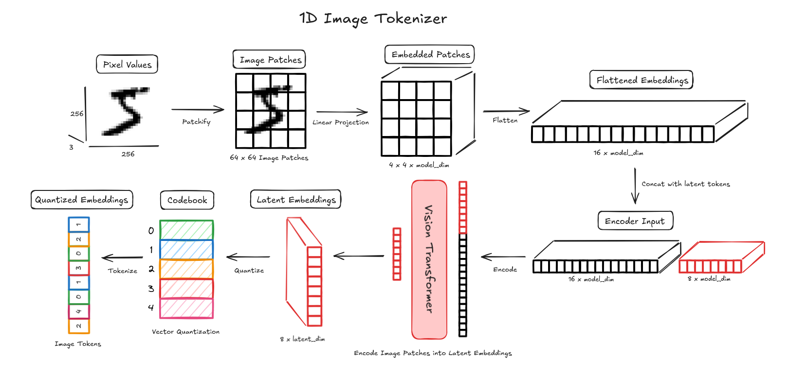

# 1D Tokenizer

Simple 1D image tokenizer from the paper An Image is Worth 32 Tokens for Reconstruction and Generation

[An Image is Worth 32 Tokens](https://arxiv.org/pdf/2406.07550)

## Image Tokenizer

The image tokenizer encodes an image represented as pixel values into a sequence of discrete tokens.

The encoder uses a vision transformer in order to embed the image into a latent space and then vector quantization is applied to the latent embeddings to get discrete tokens.

### Vision Transformer

The ViT represents an image as a sequence by first splitting the image into patches and projecting these patches into a latent space.

The encoder uses a 2D Conv layer to extract these patch embeddings. For example if the patch size is 64, the kernel size is 64 with a stride of 64, and with out channels equaling the embedding dimension. In this example and 256 x 256 rgb image will be split into a 4 x 4 grid of 64 x 64 patches. These patches are then projected to the model dim, resulting in a 4 x 4 x model_dim tensor. These embeddings are flattened and concatenated with the latent embeddings to for the input to the ViT.

### Vector Quantization

